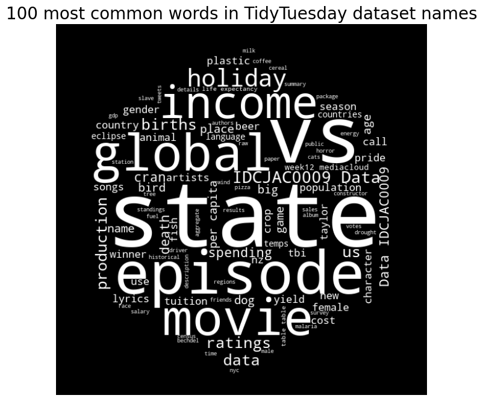
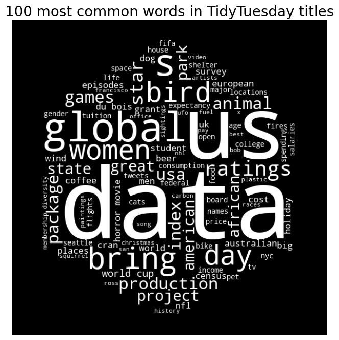

This week we're exploring tidytuesday data! The data this week comes from the {ttmeta} package, which automatically updates with information about the TidyTuesday datasets. The data shared here was compiled on 2024-06-18.

### Questions
What are the most common variable names? Of those variables, which are used to mean the same thing, and which are used to mean different things?

I looked at the most common dataset names and titles.  After exploring the data, I found those piqued my interest - why are there so many bird projects? There also seem to be a lot of movie and tv datasets. Fun!

 

