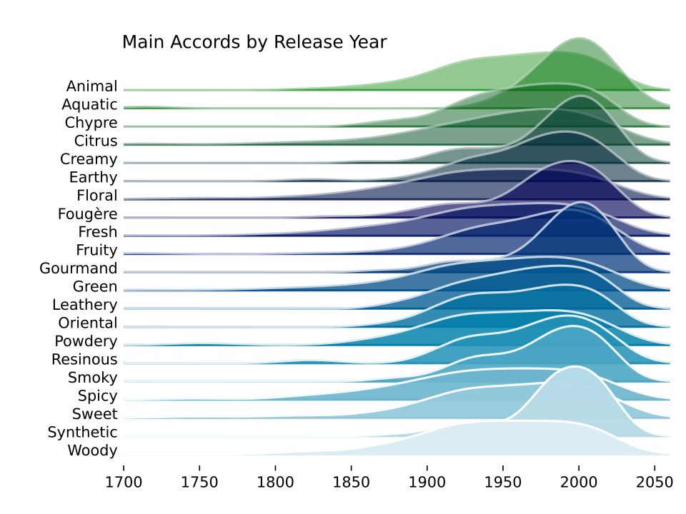

This week we're exploring the Parfumo fragrance dataset. More info here: https://github.com/rfordatascience/tidytuesday/tree/main/data/2024/2024-12-10

As usual, I'm still learning, so please let me know if you see anything amiss.

### Questions

 -   What factors most influence the rating of a perfume?
 -   Are there distinct scent families that dominate the market, and how are they perceived by users?
 -   Has the popularity of certain fragrance notes evolved over time?

 

